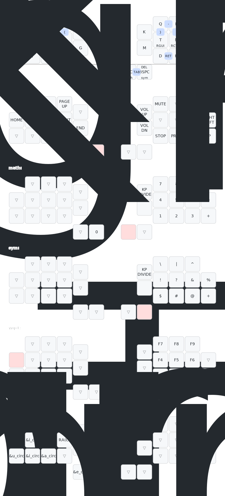

# Tolki Tern Layout

## Commands memo

### Drawing the keymap

```sh
keymap -c keymap-drawer/config.yaml parse -z config/boards/shields/tern/tern.keymap > keymap-drawer/layers.yaml \
&& yq -i '.layout.qmk_info_json = "keymap-drawer/tern_layout.json"' keymap-drawer/layers.yaml \
&& yq -i '.combos.0.align = "bottom"' keymap-drawer/layers.yaml \
&& keymap draw keymap-drawer/layers.yaml > layout.svg
```

### Building locally

In the `zmk` `app` directory:

```sh
west build --board seeeduino_xiao_rp2040 -- -DSHIELD=tern -DZMK_CONFIG=/workspaces/zmk/tern-tolki/config
```

### Bind mounting in a VSCode dev container

```json
    "type=bind,source=/Users/tolki/Development/keyboard/tern-tolki,target=${containerWorkspaceFolder}/tern-tolki,consistency=cached"
```

Then run `Rebuild Container`

## Current keymap


